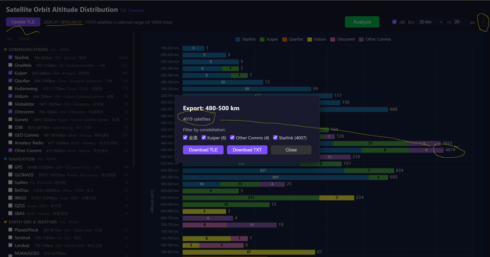

# Satellite TLE Analyzer

Interactive satellite orbital altitude distribution analyzer.

Fetches active TLE data from [Celestrak](https://celestrak.org/), classifies satellites by constellation/operator, and visualizes their orbital altitude distribution as a stacked horizontal histogram.




## Features

- **Online TLE updates** — fetch latest active satellite data from Celestrak with one click
- **Constellation classification** — ~39 categories covering Starlink, OneWeb, GPS, BeiDou, ISS, Hubble, and more (~89% coverage)
- **Stacked histogram** — altitude distribution with per-bin satellite counts, empty bin collapsing, and per-bin satellite export
- **dB mode** — switch to logarithmic scale (`20·log₁₀(count+1)`) for better visibility of sparse bins
- **Resizable sidebar** — drag the divider between sidebar and chart (200–800 px)
- **Per-satellite metadata** — country, operator, perigee/apogee, NORAD ID
- **Standalone Windows exe** — no Python required; built via PyInstaller + GitHub Actions CI

## Quick Start (Development)

```bash
pip install bottle cheroot
python analysis.py
```

Open http://localhost:15001/ in a browser.

## Windows Standalone Exe

Download `sat_stat_for_windows.zip` from the latest CI build artifact (Actions tab), extract, and run `sat_stat\sat_stat.exe`.

The app automatically opens your default browser. Click the **✕** button in the top-right corner (or visit `/api/shutdown`) to exit.

### Build Locally

```bash
pip install -r requirements-gui.txt
python build.py
```

Output: `dist/sat_stat/` (~20 MB, `--onedir` mode).

## CLI Usage

```
python analysis.py [options]
```

| Argument | Default | Description |
|---|---|---|
| `--port PORT` | `15001` | HTTP port |
| `--bind ADDR` | `127.0.0.1` | Bind address. Use `0.0.0.0` for LAN access |
| `--gui` / `--no-gui` | auto (frozen=yes, dev=no) | Auto-open browser on start |
| `--no-browser` | — | Suppress browser auto-open |

### Environment Variable

- `PORT` — equivalent to `--port`

## UI Walkthrough


1. **Left sidebar** — check/uncheck constellations. Use `ALL`/`NONE` per category or globally.
2. **Analyze** — click to compute the histogram for selected constellations.
3. **Bin width** — dropdown (1–1000 km). Changes trigger auto-analysis.
4. **Bin height (H)** — row height in pixels (1–100). Changes trigger auto-analysis.
5. **dB toggle** — switch between linear count and log scale.
6. **Update TLE** — re-fetch satellite data from Celestrak.
7. **Export** — hover over a bar segment, click the **Export** button in the tooltip to download per-bin satellite CSV.
8. **✕ — quit** the application gracefully.

## Project Structure

```
sat_stat/
├── analysis.py          # Bottle backend, TLE fetch/parse, altitude calc, API
├── build.py             # PyInstaller build script
├── requirements-gui.txt # Python deps (bottle, cheroot, pyinstaller)
├── templates/
│   ├── index.html                    # Web UI
│   ├── chart.js                      # Chart.js v4.4.7 (local, CDN fallback)
│   └── chartjs-plugin-datalabels.js  # Datalabels plugin v2 (local, CDN fallback)
├── .github/workflows/build.yml       # CI: build exe on push/tag/workflow_dispatch
├── test_workflow.py    # Playwright integration test
├── test_edge.mjs       # Edge CDP verification test
├── tle_data.json       # Cached TLE data (auto-downloaded)
├── DEPLOY.md           # WSL-specific deployment notes
└── README.md           # This file
```

## Data Sources

- TLE data: [Celestrak Active Satellites](https://celestrak.org/NORAD/elements/gp.php?GROUP=active&FORMAT=tle)
- Altitude: computed from TLE mean motion and eccentricity (mean altitude, perigee, apogee)

## License

MIT
